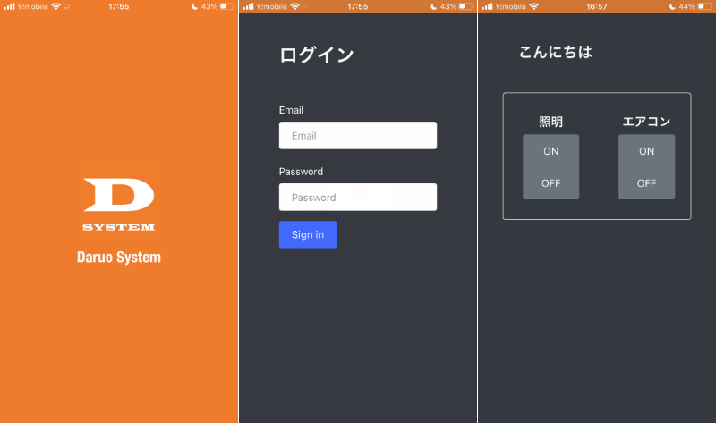
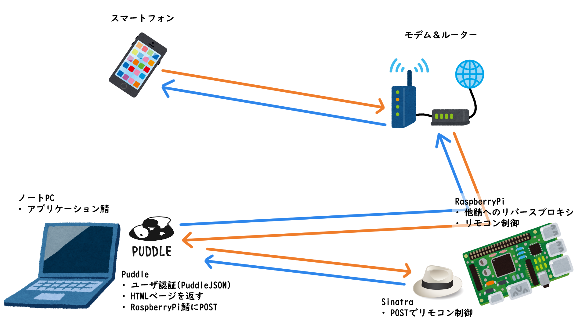

# Web Remote Controller

※開発中の画像です。

## 説明
家電を操作することができるWebアプリです。

[Puddle Framework](https://github.com/PuddleServer/Puddle)を使用したアプリの一例として作成しました。(建前)

iPhoneのHomeBridgeがあまりにも不安定で、LAN外では使用できないので作りました。(本音)

## 環境
- ノートパソコン鯖
    - Ubuntu 20.04.3 LTS
    - nginx/1.18.0 (Ubuntu)
    - deno 1.17.3 (release, x86_64-unknown-linux-gnu)
    - Puddle 1.1.2β
- RaspberryPi鯖
    - Raspbian GNU/Linux 10 (buster)
    - nginx/1.14.2
    - rbenv 1.1.2-36-g60c9339
    - ruby 2.6.3p62 (2019-04-16 revision 67580) [armv7l-linux-eabihf]
    - sinatra (2.2.0)
    - sinatra-contrib (2.2.0)
    - sinatra-reloader (1.0)
    - pyenv 1.2.20-6-gd1ae4a12
    - Python 3.8.3

## 製作時間
約5時間(細かな改修をのぞく)

## 仕組み

1. RaspberryPi鯖がノートPC鯖へリバースプロキシ。
2. メインのWebサーバーであるノートPC鯖のPuddleでユーザ認証などを行う。
3. リモコンの制御をする際は、ノートPCサーバーからRaspberryPi鯖のSinatraへPOSTリクエスト。
4. Sinatraが受け取ったリクエストに応じてirrp.pyでリモコンを制御。

## 反省と今後
- インストールされているRaspberryPi OSが32BitであるためDenoをビルドできず、まわりくどい方法を取ってしまった。早くOS入れ替えてPuddle単独で実現したい。~~(ラズパイすぐ壊れるしこのままでもいいかって言う気持ちは4割)~~
- タイマー機能があればもっと便利だと考えたので実装したい。
- RaspberryPiを拡張すれば、これをベースにオンライン家庭菜園とかできるかもしれない。
- 爆速で作ったのでリファクタリング(あああああああああああああ！！！！！！！！！！)
